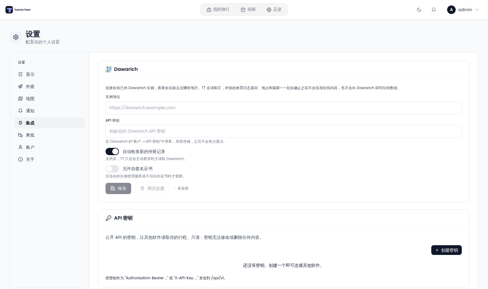

# Dawarich

Dawarich is a self-hosted location history service. Connect one to TT and TT can read back where you actually went, then offer that as journal entries, places and countries — which you confirm before anything is added.

> **Addon.** Enable **Dawarich** under [Admin: Addons](Admin-Addons) first. The connection card lives on the **Integrations** settings tab, which itself only appears when at least one integration addon is on.

> **A note for readers in mainland China.** Dawarich's own image is OpenStreetMap-based, so it is unlikely to be useful there and testing it further has little value. If you are recording travel inside China, use the built-in engine instead — see [Footprint](Footprint).

## Two data sources

The card opens with a **Data source** choice:

| Source | What it means |
|---|---|
| **External Dawarich instance** | TT reads visits and routes from a Dawarich server you run — the connection described below |
| **TT built-in engine** | A phone reports into TT itself; no external server. See [Footprint](Footprint) |

Everything further down this page is about the **external** source. The built-in engine feeds the same surfaces — the trail overlay, the suggestions, the Atlas offers — from TT's own archive.

## Connecting

**Where:** **Settings** → **Integrations** → the **Dawarich** card → **External Dawarich instance**.

| Field | What it is |
|---|---|
| **Instance address** | The base URL of your Dawarich instance |
| **API key** | Found in Dawarich under **Account → API key**. Stored encrypted, and never shown again |
| **Check for new stays automatically** | Off means TT only reads Dawarich when you ask it to |
| **Allow self-signed certificate** | Only needed if your instance uses a certificate your server does not trust |

**Save** stores the connection; **Test connection** verifies it and reports the result, so a wrong address or key is caught before you rely on it.

## What TT does with it — and what it does not

TT is a **reader** here:

- It reads visits and recorded routes from Dawarich.
- It *suggests* journal entries, places and countries from what it read.
- Nothing is added to your trips until **you confirm it**, and TT never writes back to Dawarich.

That is deliberate: a poll that quietly ticked off countries would overwrite decisions you made by hand.

## The recorded trail on the map

A recorded route can be drawn on the trip map, in the plan view.

- **Toggle it** from the pill at the bottom-right of the map, which also carries the status — loading, nothing recorded for these dates, instance unreachable, or offline — so you can see *why* there is no line rather than guessing.
- The line is drawn under the planned route, because the plan is what you are editing.
- It is drawn, never applied: correcting the plan from the recording is a different feature.

Works on all three map engines (Leaflet, MapLibre/Mapbox GL and AMap).

## Related

- [Footprint](Footprint) — recording your own movement inside TT, with no external service.
- [Journey Journal](Journey-Journal) for what the suggestions turn into.
- [Atlas](Atlas) for the countries and cities side.
