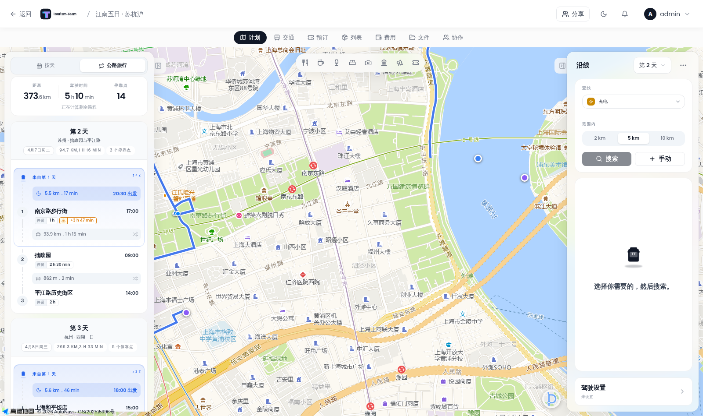

# New Features in 0.8.0

This release brings the whole of upstream TREK 4.3.0 into Tourism-Team, adapted to TT's own map engines, its own AMap (高德) support and its own look. Everything below is new in 0.8.0; each feature also has a home in its usual place in this wiki, linked from the sections here.

> **Screenshots in this page show the Chinese interface.** TT's language follows the instance's default language, so the shots were taken on a Chinese-language instance. The settings and buttons are the same in every language.

## Road trip mode

The headline feature. A trip can now be read as a *drive* rather than as a list of days.

**Where:** open a trip → **Plan** tab → the switcher at the top of the left rail, between **Days** and **Road trip**.

Switching to **Road trip** replaces the day rail with the drive rail: total distance, total driving time and stop count for the whole trip, then each day as a chain of legs and stops with departure and arrival times.

Full details: [Road Trip Mode](Road-Trip).

## Along-the-route search (corridor)

Ask what is on the way, not what is nearby. This is the part of road trip mode that answers "where do I charge next".

**Where:** in road trip mode, the **Along the route** panel on the right.

- **Pick categories** — fuel, charging, service area, campsite, lodging, food, sights. Several at once; they travel in one query.
- **Pick how far** — a range chip row (2 km / 5 km / 10 km by default) narrows the search to the stretch just ahead, or **All day** covers the whole stage. The 50 km default is the widest offered.
- **Search** returns hits in driving order, each showing how far along the drive it sits and how far off the route it is, with **+** to add it to the trip.

The search follows the map engine you chose: with AMap search enabled it asks AMap, so it works where OpenStreetMap-based search is weak.

Full details: [Road Trip Mode](Road-Trip).

## Reshaping the drive by dragging the route

**Where:** road trip mode → click the drawn route.

A blue handle appears where you clicked. Drag it and the drive is re-routed through it.

- **Tap a handle** to select it — it gains a ring.
- **Drag it** to move it; the route redraws through the new position.
- **Delete it** by dragging the selected handle onto the red **Drag here to delete** zone that appears at the top-left of the map. On a desktop you can also right-click the handle.
- Handles only appear at zoom 9 or closer, because a handle at a continental zoom moves the route by kilometres per pixel.

Works on all three map engines (Leaflet, MapLibre/Mapbox GL and AMap).

Full details: [Road Trip Mode](Road-Trip).

## Importing a route from an AMap (高德) link

The along-the-route panel already accepted Google Maps directions links. It now accepts AMap links too.

**Where:** road trip mode → the **⋯** menu at the top-right of the **Along the route** panel → **AMap (高德) route**.

Paste a link from `ditu.amap.com/dir` or `uri.amap.com/route`. The stops are previewed in driving order, and you choose which day to append them to.

AMap links carry GCJ-02 coordinates and TT stores WGS-84, so the positions are converted on import — the stops land where AMap shows them, not a few hundred metres east.

Full details: [Road Trip Mode](Road-Trip).

## Fuel and charge range

**Where:** road trip mode → **Driving settings** card at the bottom of the **Along the route** panel → **Vehicle**.

Tell TT your vehicle (combustion or electric), tank or battery size, consumption, current fill level and a safety margin, and the drive rail marks the point along each leg where you would run dry, with a **Search** action to find a station or charger around that point.

## Per-day driving limits and day windows

**Where:** road trip mode → **Driving settings** → **Daily travel times** and **Driving time**.

Cap the minutes per leg and per day, and set the daily start and end times. TT then flags days that overrun, and can place an automatic overnight stop where the day's end time falls.

- **End the day along the route** — pause on the road at the end time.
- **End the day at the last place** — stop before the next place would exceed it.
- **Restore automatic day endings** undoes manual boundaries.

## Overnight stops and night pauses

A day that runs past its end time gets a night-pause marker at the point where it stops, showing which night it is and whether the car stands at a place or beside the road. Night pauses are automatic; there is no separate switch. Marking a stop as an **Overnight** stay is done from the stop's own sheet.

## Service stops

Fuel, charging, rest areas and other stops that are *on the drive* rather than destinations can be marked with a stop kind, so they are left out of the day's stop count — a day with a charger between four places still reads as four stops.

**Where:** road trip mode → a stop's sheet → the stop-kind picker.

## Avoid categories

**Where:** road trip mode → **Driving settings** → **Avoid**.

Ask the router to avoid **tolls**, **motorways** and **ferries**. Available where the routing profile supports it.

## Hazard and weather layers

**Where:** road trip mode → **Driving settings** → **Current warnings** → **Show hazard areas**.

Draws current weather and disaster notices along the drive. These are current notices, not forecasts for your travel dates, and they never change the route.

Also in road trip mode: an optional sunset/moon marker layer along the drive.

## Document sync

Keep the documents for a trip in a cloud store and let TT pair them with the trip, without moving the files themselves out of that store.

**Where:** a trip → **Files** tab → the **Document sync** button in the toolbar.

> The button only appears once a document provider is configured on the instance, or the trip is already bound to a store — so on a fresh instance you will not see it until an admin or owner sets one up. Members of a trip that has a binding always see it, so they can tell where their documents live.

Full details: [Document Sync](Document-Sync).

## Dawarich integration

Connect a self-hosted Dawarich instance to read back where you actually went.

**Where:** **Settings** → **Integrations** → the **Dawarich** card.

Enter the instance address and API key, optionally let TT check for new stays automatically, and save.

Dawarich is read-only from TT's side: TT suggests journal entries, places and countries from what Dawarich recorded, and nothing is added or written back until you confirm it. The recorded trail can also be drawn on the trip map as a toggle.

> **Note for readers in mainland China:** Dawarich's own image is OpenStreetMap-based, so it is unlikely to be useful there. Dawarich remains available for instances elsewhere; TT has not replaced it.

## Offline foundations

IndexedDB caching, a queued-write replay layer, and a viewport-prefetched place cache now back the planner, so panning and searching keep working with a weak connection.

There is no setting to turn on: offline behaviour is automatic, and the app says when it is working from cache. See [Offline Mode and PWA](Offline-Mode-and-PWA).

## Collection lists as files

A saved list can now leave the instance as a file, and come back on another one.

**Where:** **Collections** → open a list → **Export** in the list's hero. **Import a list from a file** is offered beside it.

Two formats: TT's own list file (keeps labels, colours and idea/want-to-go/visited status) and GPX (for other map tools).

Full details: [Collections](Collections).

## Receipts on expenses

Attach pictures or PDFs of receipts to a trip expense.

**Where:** a trip → **Costs** tab → add or open an expense → **Add receipt**.

Receipts are stored with the trip's files, so they are also reachable from the **Files** tab, and they are removed with the expense.

Full details: [Costs](Budget-Tracking).

## Shared links and pictures in trip chat

**Where:** a trip → **Collab** tab → the chat.

- Paste a picture into the chat and it is uploaded and shown inline.
- Paste a link and it becomes a preview card.

## Printed route map in PDF export

The trip PDF can now carry its map.

**Where:** a trip → **Plan** → **Export** → **Document** → PDF. The **Route overview** section draws the trip's route as a vector map, so the printed plan shows the shape of the drive without needing a tile server. If it cannot draw, the rest of the document is unaffected.

Full details: [PDF Export](PDF-Export).

## Public transit journeys

Plan a leg by public transport and pull real connections into the itinerary.

**Where:** a trip → **Transport** → add a booking → **Public transit**.

Enter origin and destination stops and TT fetches connections. Available where the instance has a transit provider configured.

## Mobile journey timeline

The phone's Journey view gained a **day scrubber** for moving through a trip's days, and a **photo-as-card** layout that gives each entry a photo-led card instead of a text row.

**Where:** on a phone, open a journey. See [Journey Journal](Journey-Journal).

## Place search shows its source

Search results are now labelled with the provider that produced them — 高德 where AMap answered, OpenStreetMap where the free sources did — instead of the label being fixed. Useful when an instance has several providers configured.

See [Places and Search](Places-and-Search).

## Preparing an update from the admin panel

**Where:** **Admin** → the update notice → **Prepare update**.

TT checks for a newer release as before, and now a **Prepare update** action runs the preparation on the server and reports what it did, instead of only printing instructions for you to copy. The connector itself still runs outside the app — TT prepares, it does not replace its own container.

Full details: [Updating](Updating).

---

## Where each feature lives in this wiki

| Feature | Page |
|---|---|
| Road trip mode, corridor search, vias, AMap route import, range, limits, hazards | [Road Trip Mode](Road-Trip) |
| Document sync | [Document Sync](Document-Sync) |
| Dawarich | [Dawarich](Dawarich) |
| Collection files | [Collections](Collections) |
| Receipts | [Costs](Budget-Tracking) |
| PDF route map | [PDF Export](PDF-Export) |
| Offline behaviour | [Offline Mode and PWA](Offline-Mode-and-PWA) |
| Maps and engines | [Map Features](Map-Features), [Map Settings](Map-Settings), [AMap (高德)](AMap) |
| Update preparation | [Updating](Updating) |
